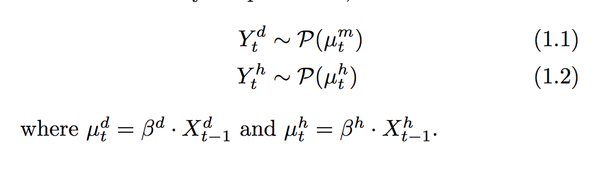

# Predicting Airline Delays

### Introduction

For this analysis, I will consider the 2016 airline delay data only, and my goal will be to predict delays using this one year of data. 

I have several hypotheses which I will evaluate throughout this presentation.

**Goal:** *Given all of the airline data from 2016, can we predict delays?*
I tried this using two methods:

1. Regression on the departure delay.
2. Classification above a 20 minute threshold (defined as a delay by most major airlines).

I used the following data in my analysis.

### Data sets:

- [Airline On-Time Performance Data. RITA/BTS. Bureau of Transportation Statistics.]( https://www.transtats.bts.gov). 2016.

- [Local Climatological Data. National Centers for Environmental Information.]( https://www.ncdc.noaa.gov/cdo-web/datatools/lcd). 2016.

- [Flight Standards Service — Civil Aviation Registry. Federal Aviation Administration.]( http://stat-computing.org/dataexpo/2009/plane-data.csv). 2009.

- [Passenger Boardings at Commercial Service Airports. Federal Aviation Administration.] (https://www.faa.gov/airports/planning_capacity/passenger_allcargo_stats/passenger/media/cy14-commercial-service-enplanements.pdf). 2014.  

*Caveats of above data:* Plane data is from 2009, but will have missing planes from 2010-2016. 

### Main Results:

#### Performance:

We compare performance of multiple models with and without the additional data used above. More precisely, we define:

**Original:** Only the Airline On-Time Performance Data.

**Enhanced:** All of the data included in the above links, in addition to a customized Poisson variable. More precisely, I define two time dependent variables with Poisson priors given by:

where the P represents a Poisson distribution with time dependent mean depending on the delay of the previous hour or day respectively.

The hour variable (called **hourly_poisson** below) is seen to be the top variable for the Gradient Boosted Trees and second top variable for the Random Forest classifier. 

Below we see a comparison of three different classification models for the original and enriched variable set. The best performance obtained was by the Random Forest Classifier with the enriched data set, which achieved an ROC of 0.76.

#### Variable Importances:

The variables are explained further in the notebook (Processing Weather Data), but for the reader's convenience here are some descriptions.

**Weather:** `PRCP`, `SNOW` and `WT03` are weather variables representing precipitation, snow and wind. 

**Plane Model:** `model` and `issue_date` correspond to the make of the plane. 

**Poisson Regression Time Series:** `poisson_hourly` and `poisson_daily` represent the variables I discussed briefly above.

**Gradient Boosted Trees:**

**Random Forest:**

 